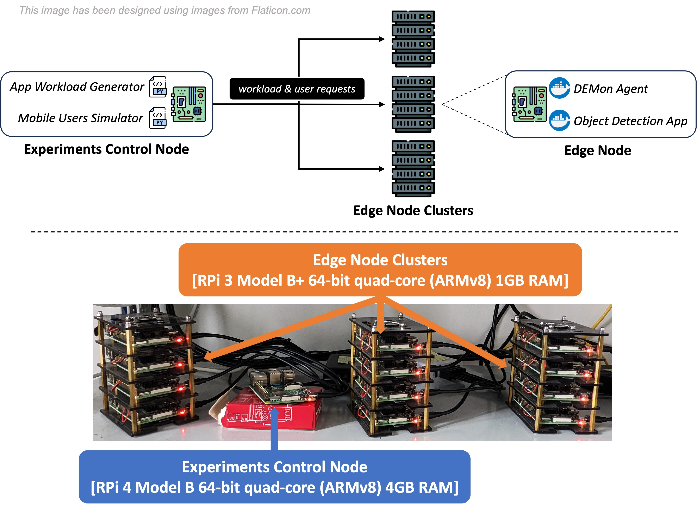

# Use-case experiment



## Requirements
```shell
python3 -m venv venv
source venv/bin/activate

pip install -r requirements.txt

ansible-galaxy install geerlingguy.docker
ansible-galaxy install geerlingguy.pip
```

## Configure RPi devices, deploy DEMon container, and deploy iWebLens server
We provide an example [inventory file](`inventory.yml`) representing our in-lab testbed with 12 RaspberryPi.
SSH credentials (`ansible_user` and `ansible_password`) are specified as inventory vars, you can specify `pi_user` and `pi_password` vars via cmdline arguments or secret file.

```shell
cd ansible
ansible-playbook -i inventory.yml install-docker.yml -e "pi_user=pi" -e "pi_password=pi" # Change me!
ansible-playbook -i inventory.yml deploy-demon.yml -e "pi_user=pi" -e "pi_password=pi" # Change me!
ansible-playbook -i inventory.yml deploy-iweblens.yml -e "pi_user=pi" -e "pi_password=pi" # Change me!
cd ..
```

> To limit the nodes where to apply the Ansible playbook, add `--limit HOSTNAME|GROUP_NAME`

## Run the experiment
```shell
python experiment.py True # Change to False DEMon is already gossiping
```